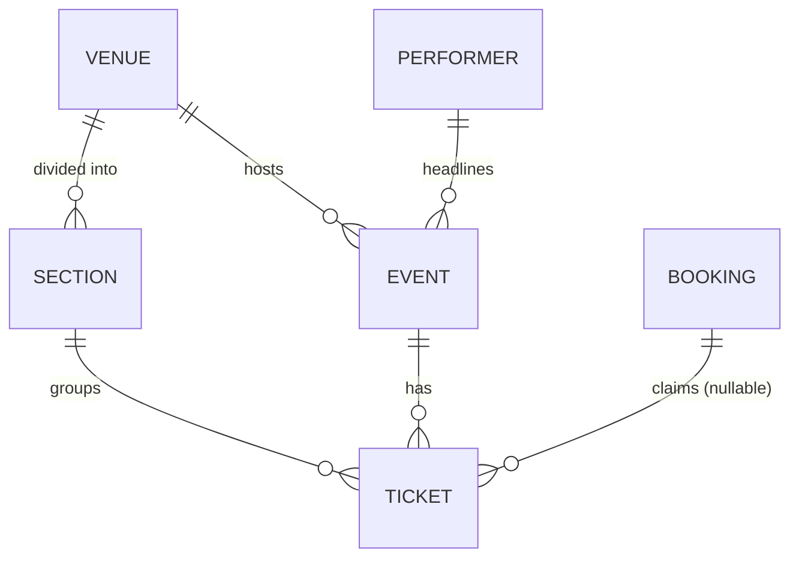

# event-service — API surface & data model

Owns the **catalog**: events, venues, performers, and the per-event seat inventory
(`ticket` rows). Serves the public read API, an admin CRUD API, and an internal
projection for the search indexer. Publishes `EventChangeMessage` on `events:changes`
after every catalog change. Reads (never writes) the section-availability counters that
queue-service / booking-service maintain in Redis.

> Status: **design** — this document is the agreed contract; implementation follows.

## Data model

One shared PostgreSQL instance (not database-per-service). The split that matters is
**column ownership**: who is allowed to write which columns.

Entity relationships (each `1 ──< N` reads "one … has many …"):

```
   ┌───────────┐                         ┌───────────┐
   │ performer │                         │   venue   │
   └─────┬─────┘                         └─────┬─────┘
         │ 1                             1 │   │ 1
         │ headlines           divided into│   │ hosts
         │ N                             N │   │ N
         │         ┌───────────┐           │   │
         └────────►│   event   │◄──────────┘   │
                   └─────┬─────┘               │
                       1 │                     │
                  has    │ N                   ▼
                         │              ┌───────────┐
                         ▼          N   │  section  │
                   ┌───────────┐ ◄──────┤           │
                   │  ticket   │   1    └───────────┘
                   └─────┬─────┘   groups
                       N │
              claimed by │ (booking_id, nullable)
                       1 │
                         ▼
                   ┌───────────┐
                   │  booking  │   ← owned by booking-service
                   └───────────┘
```

Relationship legend (the arrow points from the "one" side to the "many" side):

| Relationship              | Meaning |
|---------------------------|---------|
| venue `1 ──< N` section   | a venue is divided into many sections |
| venue `1 ──< N` event     | a venue hosts many events |
| performer `1 ──< N` event | a performer headlines many events |
| event `1 ──< N` ticket    | an event has many tickets (one per seat) |
| section `1 ──< N` ticket  | every ticket belongs to exactly one section |
| booking `1 ──< N` ticket  | a booking claims many tickets; `ticket.booking_id` is nullable (null = unsold), and `booking` lives in booking-service |

The same thing as a Mermaid ER diagram (renders in GitHub / IntelliJ markdown preview):



### Tables

| Table       | Owner (writes)                    | Columns |
|-------------|-----------------------------------|---------|
| `venue`     | event-service                     | `id, name, address` |
| `section`   | event-service                     | `id, venue_id (FK), name, capacity` — physical sections of a venue |
| `performer` | event-service                     | `id, name, description` |
| `event`     | event-service                     | `id, name, description, venue_id (FK), performer_id (FK), starts_at, status (DRAFT/PUBLISHED/CANCELLED), created_at` |
| `ticket`    | **split** (see below)             | `id, event_id (FK), section_id (FK), seat_label, price` **+** `status (AVAILABLE/SOLD/CANCELLED), booking_id (nullable FK)` |
| `booking`   | booking-service (not here)        | `id, user_id, status, created_at, total, payment_ref` |

### The `ticket` ownership split

- **event-service writes** the inventory columns — `id, event_id, section_id, seat_label,
  price` — once, when an event is **published** (one row per physical seat in the venue's
  sections).
- **booking-service writes** the lifecycle columns — `status, booking_id` — inside its
  short `SELECT … FOR UPDATE` confirm transaction.
- **Discipline rule:** event-service never touches `status`/`booking_id`; booking-service
  never touches the inventory columns. This is what keeps a single shared table safe with
  two writers. No `booking_seat` junction — `ticket.booking_id` points back to the booking,
  so listing a booking's seats is one table read.

> Why not store seats in `Venue.seatmap` and a separate booking ticket table? Because the
> seat catalog (what seats exist + prices) must be served by event-service for display and
> for search indexing; making the catalog depend on the transactional service would point
> the dependency arrow the wrong way.

## Section availability (the dynamic count)

Individual seat status is **never** exposed. What clients see is a per-section count,
computed conservatively:

```
section_available = total_seats − sold − active_reservations
```

| Term                  | Source                | Notes |
|-----------------------|-----------------------|-------|
| `total_seats`         | Postgres (authoritative) | count of `ticket` rows for (event, section) |
| `sold`                | Postgres (authoritative); `section:sold` Redis counter as fast mirror | tickets with `status = SOLD` |
| `active_reservations` | Redis `section:reservations` sorted set | Redis seat holds **+** admitted-but-not-yet-bought queue users |

A "reservation" deliberately includes admitted queue users: we assume everyone admitted
will complete a purchase, so the queue never admits more people than a section can serve.

**How it stays live without a cron** — the reservations live in a Redis **sorted set**
per section, member = hold/admission id, score = expiry timestamp. Reading the live count
is `ZREMRANGEBYSCORE key 0 <now>` (drop expired) then `ZCARD`. Expiry is reclaimed lazily
on access — no cron, consistent with the implicit-TTL design in the root README.

### Added to `common.redis.RedisKeys`

event-service only *reads* these, but the key spellings are a cross-service contract, so
they live in `common.redis.RedisKeys` next to the existing builders:

```java
// Redis integer, INCR'd in booking-service's confirm tx; fast mirror of PG sold count.
public static String sectionSold(long eventId, long sectionId) {
    return "section:sold:" + eventId + ":" + sectionId;
}

// Redis sorted set: member = holdId/userId, score = expiry epoch millis.
// Written by queue-service (admissions) and booking-service (holds); read here.
public static String sectionReservations(long eventId, long sectionId) {
    return "section:reservations:" + eventId + ":" + sectionId;
}
```

## API surface

Three audiences. Paths below are **service-relative**; the gateway later routes
`/api/**` → event-service and applies auth/rate limiting. Internal paths are never
exposed through the gateway.

### 1. External — public reads (via gateway)

| Method & path | Purpose | Notes |
|---|---|---|
| `GET /events` | Browse/list events | Paged, simple filters (`venueId`, `from`, `to`). Full-text search is search-service's job, not this. |
| `GET /events/{eventId}` | Event detail | event + venue + performer + sections (each with `priceFrom` and live `available`). |
| `GET /events/{eventId}/availability` | Lightweight live counts | Sections with `available` only — for cheap polling/refresh without the full payload. |

`GET /events/{eventId}` response:

```json
{
  "id": 42,
  "name": "Imagine Dragons — Loom Tour",
  "description": "...",
  "startsAt": "2026-08-14T20:00:00Z",
  "status": "PUBLISHED",
  "venue": { "id": 7, "name": "The O2 Arena", "address": "..." },
  "performer": { "id": 3, "name": "Imagine Dragons" },
  "sections": [
    { "sectionId": 100, "name": "Floor A", "priceFrom": 180.00, "available": 42 },
    { "sectionId": 101, "name": "Balcony",  "priceFrom":  90.00, "available": 310 }
  ]
}
```

`GET /events/{eventId}/availability` response (poll-friendly):

```json
{
  "eventId": 42,
  "sections": [
    { "sectionId": 100, "available": 42 },
    { "sectionId": 101, "available": 310 }
  ]
}
```

> No per-seat list is returned anywhere — by design.

### 2. External — admin CRUD (via gateway, admin-gated)

Auth is enforced at the gateway later; for now these are plain endpoints.

| Method & path | Purpose |
|---|---|
| `POST /admin/venues` · `GET /admin/venues/{id}` | Create / read a venue |
| `POST /admin/venues/{venueId}/sections` | Define a section + its `capacity` |
| `POST /admin/performers` | Create a performer |
| `POST /admin/events` | Create an event in `DRAFT` |
| `PUT /admin/events/{eventId}` | Edit a draft/published event |
| `POST /admin/events/{eventId}/publish` | **Generate `ticket` rows** from the venue's sections + pricing, set `PUBLISHED`, publish `EventChangeMessage(CREATED)` |
| `DELETE /admin/events/{eventId}` | Set `CANCELLED`, publish `EventChangeMessage(DELETED)` |

Publish is the interesting one: it's the single moment event-service writes inventory.
`POST /admin/events/{eventId}/publish` body carries per-section pricing:

```json
{ "pricing": [ { "sectionId": 100, "price": 180.00 },
               { "sectionId": 101, "price": 90.00 } ] }
```

### 3. Internal — service-to-service (NOT via gateway)

| Method & path | Caller | Purpose |
|---|---|---|
| `GET /internal/events/{eventId}` | search-service indexer | Full indexable projection (denormalized venue/performer names) fetched when an `events:changes` message arrives. Thin-event pattern: the message carries only the id; the indexer fetches current state here so it can never index stale data. |

booking-service does **not** call event-service — it shares the database and reads the
`ticket` table directly (it already writes `status`/`booking_id` there).

## Errors

Single error shape across endpoints (candidate for `common` once the first controller
exists, per common's README):

```json
{ "timestamp": "2026-06-15T09:00:00Z", "status": 404,
  "error": "Not Found", "message": "event 42 not found", "path": "/events/42" }
```

| Case | Status |
|---|---|
| Unknown event/venue/performer id | 404 |
| Validation failure (bad body / params) | 400 |
| Publish an already-published event | 409 |

## Open items

- `spring-boot-starter-data-redis-test` artifact name — assumed to follow this
  project's Boot 4 split-starter convention (like `…-data-jpa-test`); verify it resolves.
- Pagination style for `GET /events` (page/size vs cursor) — defer to implementation.
- Whether `starts_at` / time zone handling needs a dedicated field for door time vs show
  time — defer.
